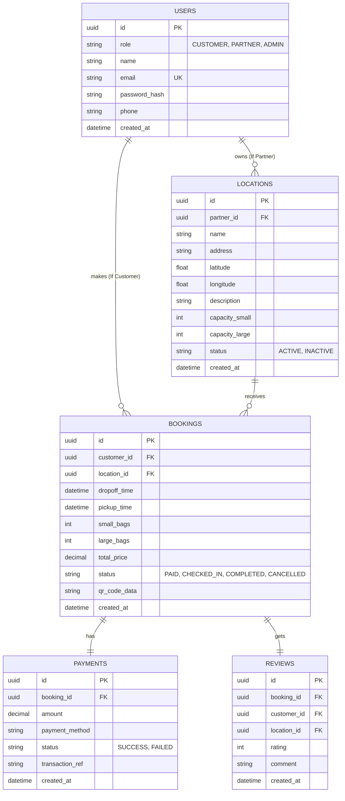

# Faak - Luggage Storage App (TOR & SRS)

แอปพลิเคชัน "Faak" (ฝาก) เป็นแพลตฟอร์มตัวกลางที่เชื่อมโยงระหว่าง **ผู้ต้องการฝากสัมภาระ (User/Traveler)** และ **ร้านค้า/โรงแรมที่มีพื้นที่ว่าง (Partner/Host)** โดยใช้เทคโนโลยี Next.js (Frontend), .NET (Backend) และ PostgreSQL (Database)

## 1. ข้อกำหนดและสถาปัตยกรรม
- **ขอบเขตเฟสแรก (MVP):** โฟกัสฟีเจอร์ของ Customer และ Partner เป็นหลัก
- **ระบบการชำระเงิน:** ชำระเงินและตัดเงินผ่านระบบทันทีเมื่อทำการจอง เพื่อป้องกันการจองทิ้ง
- **ระบบแผนที่ (Map):** ใช้ทางเลือกฟรี (เช่น OpenStreetMap ร่วมกับ Leaflet หรือ Mapbox ใน tier ฟรี)
- **โครงสร้างโปรเจกต์ (Next.js):** รวม Customer, Partner, และ Admin ไว้ในโปรเจกต์เดียวกัน และควบคุมการเข้าถึงผ่าน Role-based Access Control

## 2. ผู้ใช้งานระบบและ Roles
- **Role `CUSTOMER`:** ค้นหาสถานที่ฝาก, ทำการจอง, ชำระเงินผ่านระบบ, จัดการการจอง
- **Role `PARTNER`:** ลงทะเบียนพื้นที่, สแกน QR Code เพื่อรับ-คืนกระเป๋า, จัดการเวลาเปิด-ปิดร้าน
- **Role `ADMIN`:** ดูแลระบบโดยรวม

## 3. Database Schema Design (PostgreSQL)

## 4. API Endpoints (.NET Web API)

**Authentication (JWT):**
- `POST /api/auth/register` - สมัครสมาชิก
- `POST /api/auth/login` - เข้าสู่ระบบและรับ JWT Token

**Locations (พื้นที่รับฝาก):**
- `GET /api/locations` - ค้นหาสถานที่
- `GET /api/locations/{id}` - ดูรายละเอียดสถานที่
- `POST /api/locations` - สร้างสถานที่ใหม่
- `PUT /api/locations/{id}` - แก้ไขข้อมูลสถานที่

**Bookings (การจอง):**
- `POST /api/bookings` - สร้างการจองใหม่
- `GET /api/bookings/my-bookings` - ดูประวัติการจอง
- `GET /api/locations/{locationId}/bookings` - ดูรายการจองของสถานที่นั้น
- `PUT /api/bookings/{id}/check-in` - สแกนรับกระเป๋า
- `PUT /api/bookings/{id}/check-out` - สแกนคืนกระเป๋า

**Payments (การชำระเงิน):**
- `POST /api/payments/webhook` - แจ้งเตือนสถานะการจ่ายเงิน
